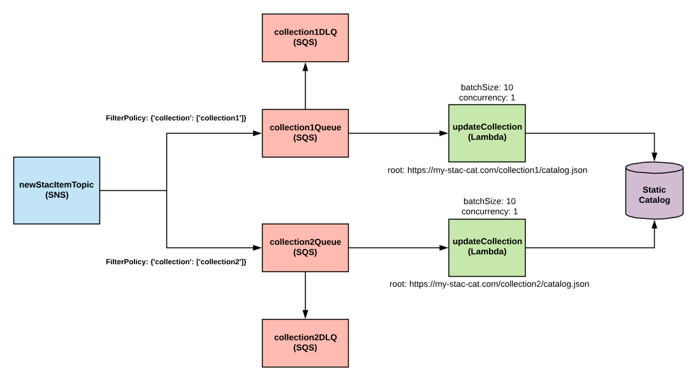
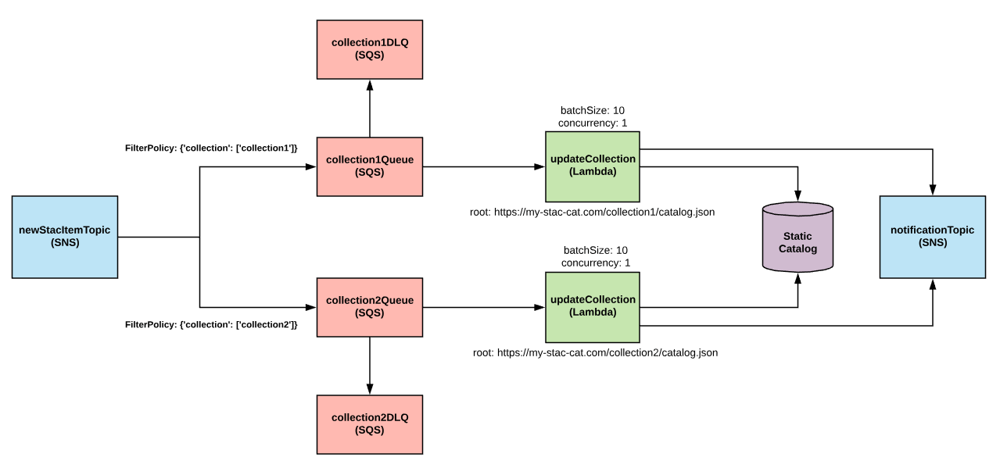
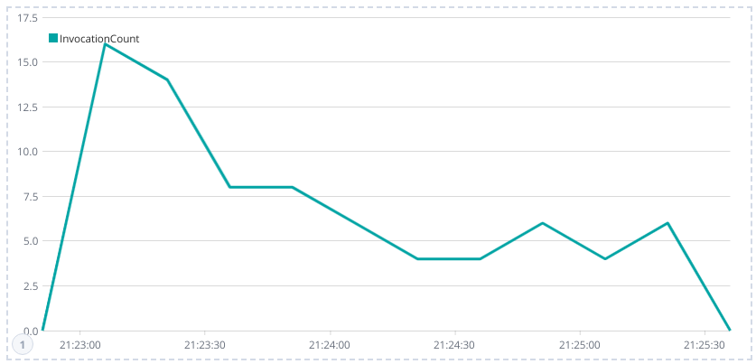
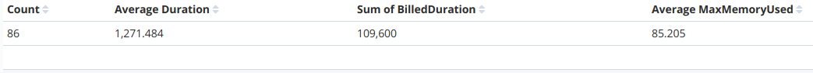

# stac-updater
CLI for building and deploying an AWS service designed to update and maintain STAC (via Lambda/SNS/SQS).  

# Installation
```
git clone https://github.com/geospatial-jeff/stac-updater
cd stac-updater
python setup.py develop
```

# Usage
Use the [stac-updater CLI](stac_updater/cli.py) to build and deploy your service.  You may customize the name, stage, and region of the service at the top of [serverless_template.yml](serverless_template.yml).

## Update Static Collection
```
# Start a new service
stac-updater new-service

# Build AWS resources to update collection
stac-updater update-collection --root https://stac.com/landsat-8-l1/catalog.json \
                               --path {landsat:path}/{landsat:row} \
                               --row  {date}/{id}

# Modify kickoff event source to s3:ObjectCreated
stac-updater modify-kickoff --type s3 --bucket_name stac-updater-kickoff

# Deploy the service to AWS
stac-updater deploy
```

Once deployed, any STAC Item uploaded to the `stac-updater-kickoff` bucket will be ingested by the service and added to the `https://stac.com/landsat-8-l1/catalog.json` collection.  Regardless of event source, the service expects the payload to contain a [STAC Item](https://github.com/radiantearth/stac-spec/tree/master/item-spec).

Each call to `update-collection` tells the services to update a single collection.  Updating multiple collections within a single deployment is accomplished with multiple calls to `update-collection`.  When updating multiple collections, the services uses a SNS fanout pattern to distribute messages across multiple queues (1 queue per collection).



## SNS Notifications
You may deploy a SNS topic which publishes messages whenever a STAC Item is succesfully uploaded to a collection.

```
# Add SNS notification
stac-updater add-notifications --topic_name stac-updater-notifications
```

Once deployed, end-users may subscribe to the newly created SNS topic to be notified when new items are added.  The SNS Topic supports filtering on bbox and collection through a SNS Filter Policy.  The following policy notifies a subscriber only when a new STAC Item is added to the `landsat-8-l1` catalog within a 1x1 degree bounding box.

```json
{
	"bbox.xmin": [{"numeric":[">=",-118]}],
	"bbox.ymin": [{"numeric":[">=",33]}],
	"bbox.xmax": [{"numeric":["<=",-117]}],
	"bbox.ymax": [{"numeric":["<=",34]}],
	"collection": ["landsat-8-l1"]
}
```



## Logging
You may pipe CloudWatch logs to a deployed instance of AWS Elasticsearch service for monitoring and visualizing with kibana.

```
# Add ES logging
stac-updater add-logging --es_host xxxxxxxxxx.region.es.amazonaws.com
```

Logs are saved to the `stac_updater_logs_YYYYMMDD` index (a new index is created each day) with the following schema:

| Field Name | Type  | Description | Example |
| ---------- | ----- | ----------- | ------- |
| id | string | Unique ID of the CloudWatch log event. | 34819275800 |
| timestamp | date | Date of the lambda invocation. | June 23rd 2019, 21:25:26.649 |
| BilledDuration | str | Time (ms) charged for execution. | 87 |
| CollectionName | str | Name of collection. | landsat8 |
| Duration | str | Runtime (ms) of the lambda function. | 442.49 |
| ItemCount | number | Number of STAC Items processed by the invocation. | 4 |
| ItemLinks | string array | URLs of STAC Items processed by the invocation. | ['https://stac.s3.amazonaws.com/landsat8/item.json'] |
| MemorySize | number | Memory limit of lambda function. | 1024 |
| MaxMemoryUsed | number | Maximum memory (MB) consumed by the lambda function. | 87 |
| RequestId | str | Unique request ID of the lambda invocation. | 87 |

The following image is a kibana time-series visualization showing number of lambda invocations binned into 15 second intervals after 200 STAC Items were pushed into the queue.  Notice how lambda scales up to handle the initial burst of messages.



It took 86 total invocations to process the 200 STAC Items.




# TODOS
- Add support for dynamic catalogs ([sat-api](https://github.com/sat-utils/sat-api), [staccato](https://github.com/boundlessgeo/staccato)).
